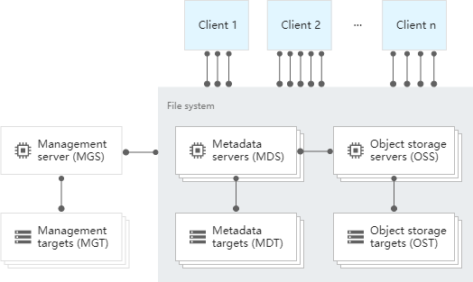

# lustre的核心组件

## lustre的核心组成
 
如图所示，lustre的核心组成主要有
- 管理服务器 (MGS) 和管理目标 (MGT) 
MGS 存储和管理一个或多个 Lustre 文件系统的配置信息。此图显示了用于管理单个 Lustre 文件系统的 MGS。MGS 为其管理的所有文件系统中的其他 Lustre 组件提供配置信息。MGS 将文件系统配置日志记录到称为 MGT 的存储设备中。MGS 需要极少的计算资源，它不是存储密集型服务。
- 元数据服务器 (MDS) 和元数据目标 (MDT) 
MDS 节点管理客户端对 Lustre 文件系统命名空间的访问权限。此命名空间包含文件系统的所有元数据，例如目录层次结构、文件创建时间和访问权限。元数据存储在称为 MDT 的存储设备中。Lustre 文件系统至少有一个 MDS 和一个关联的 MDT。若要提高元数据密集型工作负载的性能（例如，数千个客户端创建和访问数百万个小文件时），您可以向文件系统添加更多 MDS 节点。MDS 节点不需要较高的存储容量来处理元数据，但它们需要支持高 IOPS 的存储空间，通常使用SSD固态磁盘提供存储，一般mds的存储容量为1-2%的文件系统容量。
- 对象存储服务器 (OSS) 和对象存储目标 (OST) 
OSS 节点管理客户端对 Lustre 文件系统中存储的文件数据的访问权限。每个文件都存储为一个或多个 Lustre 对象。这些对象存储在单个存储设备（称为 OST）中，或跨多个 OSS 节点和 OST 带区。Lustre 文件系统至少具有一个 OSS 和一个关联的 OST。您可以添加更多 OSS 节点和 OST 以进行文件系统存储容量扩容并提升性能。文件系统的总存储容量是挂接到文件系统中所有 OSS 节点的 OST 的存储容量的总和。OSS为一个或多个本地OST提供文件I / O服务和网络请求处理。通常，OSS服务于两个到八个OST，每个最多16TB。用户文件数据存储在一个或多个对象中，每个对象位于Lustre文件系统的单独OST中。每个文件的对象数由用户配置，并可根据工作负载情况调试到最优性能。根据存储空间容量、吞吐量和 IOPS 要求选择适当的永久性磁盘类型。
- 客户端（CLIENT） 
Lustre 客户端是一个计算节点，例如虚拟机 (VM)，通过装载点访问 Lustre 文件系统。装载点为整个文件系统提供了一个统一的命名空间。您可以扩缩 Lustre 文件系统以支持 10,000 多个客户端的并发访问。Lustre 客户端并行访问 Lustre 文件系统中的所有 MDS 和 OSS 节点。这种并行访问有助于最大限度地提高文件系统的性能。并行访问还有助于减少存储热点，即访问频率高于其他位置的存储位置。热点在非并行文件系统中很常见，可能会导致客户端之间出现性能不平衡。

## lustre的初次发布

这个跟大部分的分布式文件系统都是类似的，或者说很多新系统是会参考这个架构，毕竟lustre的开发时间比较早

基本上都是：
- 管理节点
- 元数据节点
- 存储节点
- 客户端

从wiki上面看,lustre的第一个版本是

lustre: December 16, 2003; 19 years ago

看下其它几个比较常用的分布式文件系统:
- ceph:The first line of code that ended up being part of Ceph was written by Sage Weil in 2004 while at a summer internship at LLNL
- gluster:2005

发布时间差不多集中在2003-2005这个时间段，目前ceph和gluster都是红帽在维护，红帽被IBM收购了

lustre则是开始被intel收购，后来又被卖给了DDN，目前主要是DDN维护

三个系统都是开放源代码的

## lustre与其它系统的区别

三者的主要区别:
ceph:
 - 支持块，文件，对象
 - 自带同步冗余
 - 带独立元数据
 - 冗余分发在osd

gluster:
 - 支持文件，块(通过文件转的)
 - 自带同步冗余
 - 无独立元数据
 - 冗余分发在客户端

lustre:
 - 只支持文件
 - 支持异步冗余
 - 带独立元数据
 - 冗余分发在osd

上面的三个系统都对外提供文件服务，从整体功能来说，ceph的功能是最多的，也是运维最复杂了，lustre的是最少的，但是性能是最好的

基于以上的特点，所以在超算领域，基本上需要计算的数据都是使用的lustre的，而lustre因为之前的版本配置复杂，很多技术都是掌握在研究机构自己内部

网上能够看到的资料分享很少，但是从性能上来说，目前来说还是一个不会被另外两个替代的文件系统,继续在专有领域使用
