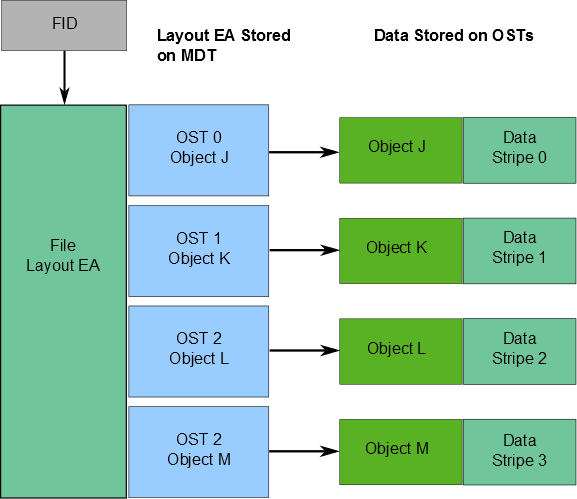
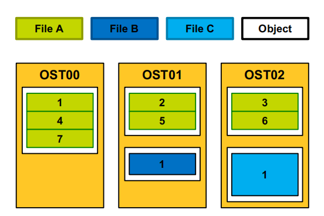

# Layout EA
<br>

布局EA是一个扩展属性，作为文件元数据的一部分存储在MDT上。
- fid列表，用于在OST(s)上定位文件数据对象
- 布局EA指向包含文件数据的OST上的1对n OST对象
- 如果布局EA指向一个对象，那么所有文件数据都完全存储在该对象中。
- 如果布局EA指向多个对象，则使用RAID 0跨对象划分文件数据条带，并且每个对象存储在不同的OST上 

当客户机想要对文件进行读写操作时，它首先从文件的MDT索引节点获取包含文件数据的对象fid列表。然后，客户机使用该信息直接连接到存储数据对象的对象存储服务器，并在文件上处理I/O。

关于文件数据在OST(s)上的位置的信息存储为一个称为布局EA的扩展属性。布局EA存储在文件的FID标识的MDT inode中。
如果文件是常规文件(不是目录或符号链接)，MDT索引节点指向包含文件数据的OST上的1-to-N OST对象。如果MDT布局EA指向一个对象，则所有文件数据都存储在该对象中。如果布局EA指向多个对象，则使用RAID 0跨对象划分文件数据条带，并且每个对象存储在不同的OST

## File Layout Stripe
<br>

Lustre中的每个文件都有自己独特的文件布局，相当于raid0的条带中的1个或多个对象组成。
- 文件布局由MDS分配
- 文件布局由客户端进行选择，有两种方式：
- - by policy(继承自父目录)
- - 用户或应用程序配置

1、 在Lustre中，使用RAID0来将文件数据条带化到一定数量的OST对象上，这个数量就是stripe_count。

2、 每个OST对象都包含文件的一段数据，当某个OST对象上的这段数据超过了stripe_size，文件数据的就会写到下一个OST对象上。

3、 默认的stripe_count是1，默认的stripe_size是1MB。用户可以为每一个目录或者每一个文件来修改这些值。

4、 文件最多被条带化到2000个OST对象上，ldiskfs支持的对象最大为16TB，ZFS最大为256PB。

Lustre文件系统高性能的主要因素之一是能够以循环方式跨多个ost划分数据。用户可以选择配置每个文件的条带数、条带大小和分布OST。条带化可以用来提高性能，使单个文件的聚合带宽超过单个OST的带宽。当单个OST没有足够的空闲空间来容纳整个文件时，条带化功能也很有用。

分条允许文件中的数据段或“块”存储在不同的OST上。在Lustre文件系统中，使用了一种RAID 0模式，其中数据在一定数量的对象上“分条”。单个文件中的对象数量称为stripe_count。每个对象都包含来自文件的数据块，并且数据块以圆形的方式写入到文件中。当写入特定对象的数据块超过条带大小时，文件中的下一个数据块将存储在下一个对象中。

## 配置文件layout

```bash
lfs setstripe [--size|-s stripe_size] [--stripe-count|-c stripe_count]
[--overstripe-count|-C stripe_count] [--index|-i start_ost] [--pool|-p pool_name] filename | dirname
```
- stripe_size --表示移动到下一个OST前向现有的OST写入的数据量，默认为1M，设置为0启用默认值，该值必须为64KB的整数倍。
- stripe_count (--stripe-count, --overstripe-count) --stripe_count表示使用的条带数量。默认值为1，设置为0启用默认值；设置为-1，对所有可用的OST（跳过满OST）进行条带化。使用 --overstripe-count参数，必要时会对每个OST条带化
- start_ost --start_ost是文件写入的第一个OST。默认值为-1，它允许MDS选择起始索引。强烈建议使用默认值，因为可以通过MDS完成空间和负载均衡。设置为非-1，则文件将指定的OST索引开始。OST索引编号从0开始。
- pool_name --pool_name指定文件将写入的OST池

例如：创建一个指定条带大小的新文件命令
```bash
[client]# lfs setstripe -s 4M /mnt/lustre/new_file
[client]# lfs getstripe /mnt/lustre/new_file
2 /mnt/lustre/4mb_file
3 lmm_stripe_count: 1
4 lmm_stripe_size: 4194304
5 lmm_pattern: 1 6 lmm_layout_gen: 0
7 lmm_stripe_offset: 1
8 obdidx objid objid group
9 1 690550 0xa8976 0
```
