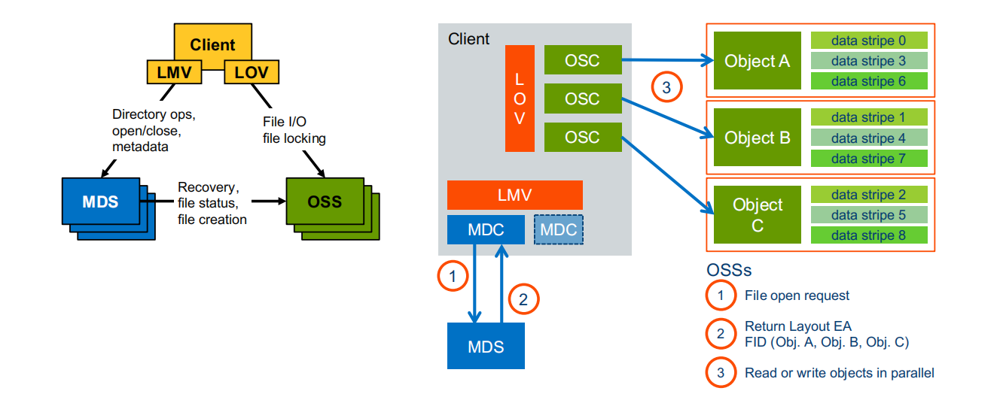
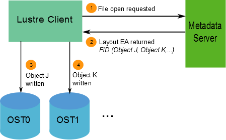

# Lustre I/O操作流程
## Client内部结构
Lustre客户端软件为Linux虚拟文件系统和Lustre 服务端交互提供接口。客户端软件由几个不同的服务组成，每个服务对应于它访问的Lustre服务的类型。Lustre客户端实例将包括一个管理客户端(MGC，图中没有)、一个或多个元数据客户端(MDC)和多个对象存储客户端(OSCs)，其中一个对应于文件系统中的每个OST。

- Lustre client提供接口连通vfs和Lustre servers。
- Lustre client实例包含1个MGC、1个或多个MDC，多个OSC（和系统中的OST一一对应）。
- MGC管理配置信息
- 每个MDC向相应的MDT处理文件系统元数据请求，包括文件和目录操作，以及元数据管理(例如，权限分配)
- 每个OSC对驻留在相应OST上的文件进行读写操作。

逻辑元数据卷(LMV)聚合mdc并向客户机提供一个逻辑元数据命名空间，提供跨所有mdt的透明访问。这允许客户端将存储在多个mdt上的目录树视为一个统一的名称空间，并且在客户端上合并条带目录，以形成对用户和应用程序可见的单一目录。

逻辑对象卷(LOV)聚合ost以提供跨所有ost的透明访问。因此，挂载Lustre文件系统的客户端看到的是一个单一的、一致的、同步的名称空间，并且文件在该名称空间中作为一个可寻址的数据对象呈现，即使跨多个ost也是如此。多个客户机可以同时写入同一个文件的不同部分，而与此同时，其他客户机可以从文件中读取。

## Client 读写流程

1、当client look up一个文件时，RPC发送给MDS去获取一个意图锁(mdc_intent_lock)，look-up意图的读锁或者创建意图的写锁。

2、MDS把锁连同attr和文件的layout ea信息返回给client。MDS返回的文件布局信息包含包含文件数据的OST对象列表，以及描述数据如何跨对象集分布的布局访问模式。布局信息允许客户端直接从ost访问数据。这样Client就能直接和包含OST对象的OST进行数据交互。文件系统中的每个文件都有独特的布局:文件之间不共享对象。

3、当新文件第一次打开时，MDS会根据请求的layout(lov_user_md)为该文件分配OST对象，并通过RPC到OSS去创建OST对象，并返回对象的ID。一旦文件打开了，client就直接和OSS进行交互。

Lustre文件系统中的所有文件和对象都由唯一的128位设备独立的文件标识符(FID)引用。FID是Lustre客户端用来识别文件对象的引用。注意，ost上的每个数据对象和mdt上的每个元数据索引节点对象都有一个FID。fid提供了UNIX inode号的替换，后者在2.0版本之前的Lustre版本中使用。

当mount命令在Lustre客户机上发出时，客户机将首先连接到
MGS，以便检索文件系统的配置信息。这将包括存储在MDT0上的文件系统根目录的位置。客户端连接到运行MDT0的MDS，并挂载文件系统根目录。

